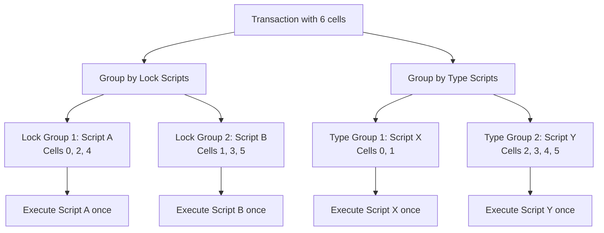

## Description

Comprehensive guide to CKB's script grouping optimization mechanism, covering how identical scripts are batched for single execution, GroupInput/GroupOutput sources, performance benefits, and development patterns. Features practical examples, testing strategies, debugging techniques, and best practices for efficient script development with group-aware design patterns.

## Overview

Script groups are a fundamental optimization in CKB that prevents redundant script execution. When multiple cells in a transaction use identical scripts, CKB groups them together and executes the script only once for the entire group, significantly improving performance and reducing computational overhead.

## Script Grouping Mechanism

### Grouping Criteria

Scripts are grouped by exact match of:
- `code_hash` - The hash identifying the script code
- `hash_type` - How to locate the code (Data, Type, Data1)  
- `args` - Script arguments

```rust
// These scripts will be in the same group
let script_a = Script::new_builder()
    .code_hash(udt_code_hash.pack())
    .hash_type(ScriptHashType::Type.into())
    .args(token_id.pack())
    .build();

let script_b = Script::new_builder()
    .code_hash(udt_code_hash.pack())  // Same code_hash
    .hash_type(ScriptHashType::Type.into())  // Same hash_type
    .args(token_id.pack())  // Same args
    .build();

// script_a and script_b are identical and will be grouped
```

### Execution Model



## Group Sources: GroupInput and GroupOutput

Script groups enable filtered access to transaction data through specialized sources.

### Source Behavior

| Source | Description | Lock Scripts | Type Scripts |
|--------|-------------|--------------|--------------|
| `Input` | All transaction inputs | ✅ All inputs | ✅ All inputs |
| `Output` | All transaction outputs | ✅ All outputs | ✅ All outputs |
| `GroupInput` | Inputs with same script | ✅ Same lock inputs | ✅ Same type inputs |
| `GroupOutput` | Outputs with same script | ❌ Empty | ✅ Same type outputs |

### Why GroupOutput is Empty for Lock Scripts

Lock scripts only execute for transaction inputs (cells being spent), never for outputs (cells being created). Since lock scripts don't execute on outputs, `GroupOutput` returns no cells for lock script execution contexts.

```rust
// Lock script context
pub fn lock_script_main() -> Result<(), Error> {
    // ✅ This works - lock scripts execute on inputs
    for input in QueryIter::new(load_input, Source::GroupInput) {
        validate_spending_authorization(&input)?;
    }
    
    // ❌ This returns empty - lock scripts don't execute on outputs
    for output in QueryIter::new(load_cell, Source::GroupOutput) {
        // This loop never executes
    }
    
    Ok(())
}
```

## Practical Examples

### Token Transfer Validation

Consider a transaction transferring TokenA and TokenB:

```rust
// Transaction structure
Transaction {
    inputs: [
        CellInput { lock: alice_lock, type: Some(token_a) },  // Alice's TokenA
        CellInput { lock: alice_lock, type: Some(token_b) },  // Alice's TokenB
    ],
    outputs: [
        CellOutput { lock: bob_lock, type: Some(token_a) },   // Bob receives TokenA
        CellOutput { lock: charlie_lock, type: Some(token_b) }, // Charlie receives TokenB
    ],
}
```

### Script Execution Groups

**Lock Script Groups:**
- Alice's lock script executes once for both inputs (inputs 0 and 1)
- Bob's and Charlie's locks don't execute (they're on outputs)

**Type Script Groups:**
- TokenA script executes once (sees input 0 and output 0)
- TokenB script executes once (sees input 1 and output 1)

### TokenA Type Script Implementation

```rust
pub fn token_a_main() -> Result<(), Error> {
    let mut input_amount = 0u128;
    let mut output_amount = 0u128;
    
    // Sum TokenA inputs (only input 0 in this case)
    for data in QueryIter::new(load_cell_data, Source::GroupInput) {
        let amount = parse_token_amount(&data)?;
        input_amount = input_amount.checked_add(amount)
            .ok_or(Error::Overflow)?;
    }
    
    // Sum TokenA outputs (only output 0 in this case)
    for data in QueryIter::new(load_cell_data, Source::GroupOutput) {
        let amount = parse_token_amount(&data)?;
        output_amount = output_amount.checked_add(amount)
            .ok_or(Error::Overflow)?;
    }
    
    // Validate conservation: input >= output (allow burning)
    if output_amount > input_amount {
        return Err(Error::TokenInflation);
    }
    
    Ok(())
}
```

## Advanced Group Patterns

### JSON Cell Validation

A type script that validates all cells contain valid JSON data:

```rust
use lite_json::json_parser::parse_json;

pub fn json_cell_main() -> Result<(), Error> {
    // Validate all output cells in this group contain valid JSON
    for (index, data) in QueryIter::new(load_cell_data, Source::GroupOutput).enumerate() {
        // Parse bytes as UTF-8 string
        let json_str = core::str::from_utf8(&data)
            .map_err(|_| Error::InvalidUtf8(index))?;
        
        // Validate JSON syntax
        parse_json(json_str)
            .map_err(|_| Error::InvalidJson(index))?;
    }
    
    Ok(())
}
```

### Multi-Token Atomic Swap

In atomic swaps, each token type validates its own conservation:

```rust
// TokenA script only sees TokenA cells
pub fn token_a_atomic_swap() -> Result<(), Error> {
    let input_cells: Vec<_> = QueryIter::new(load_cell, Source::GroupInput).collect();
    let output_cells: Vec<_> = QueryIter::new(load_cell, Source::GroupOutput).collect();
    
    // TokenA-specific validation
    validate_token_conservation(&input_cells, &output_cells)?;
    validate_no_token_minting(&input_cells, &output_cells)?;
    
    Ok(())
}

// TokenB script independently validates TokenB cells
pub fn token_b_atomic_swap() -> Result<(), Error> {
    // Same pattern, but only sees TokenB cells
    let input_cells: Vec<_> = QueryIter::new(load_cell, Source::GroupInput).collect();
    let output_cells: Vec<_> = QueryIter::new(load_cell, Source::GroupOutput).collect();
    
    validate_token_conservation(&input_cells, &output_cells)?;
    validate_no_token_minting(&input_cells, &output_cells)?;
    
    Ok(())
}
```

### State Machine with Groups

```rust
pub fn state_machine_main() -> Result<(), Error> {
    let inputs: Vec<_> = QueryIter::new(load_cell_data, Source::GroupInput).collect();
    let outputs: Vec<_> = QueryIter::new(load_cell_data, Source::GroupOutput).collect();
    
    // State machine should have exactly one input and output
    if inputs.len() != 1 || outputs.len() != 1 {
        return Err(Error::InvalidStateTransition);
    }
    
    let current_state = parse_state(&inputs[0])?;
    let next_state = parse_state(&outputs[0])?;
    
    // Validate state transition is allowed
    validate_state_transition(&current_state, &next_state)?;
    
    Ok(())
}

fn validate_state_transition(current: &State, next: &State) -> Result<(), Error> {
    match (current, next) {
        (State::Initialized, State::Active) => Ok(()),
        (State::Active, State::Paused) => Ok(()),
        (State::Paused, State::Active) => Ok(()),
        (State::Active, State::Terminated) => Ok(()),
        _ => Err(Error::InvalidTransition),
    }
}
```

## Performance Benefits

### Without Script Groups

```rust
// Inefficient: Each cell triggers separate script execution
for each input_cell {
    if input_cell.lock == script_a {
        execute_script_a();  // Executes multiple times
    }
}

for each output_cell {
    if output_cell.type == script_x {
        execute_script_x();  // Executes multiple times
    }
}
```

### With Script Groups

```rust
// Efficient: Each unique script executes only once
let lock_groups = group_by_lock_script(inputs);
for (script, cells) in lock_groups {
    execute_script_once(script, cells);  // Single execution per unique script
}

let type_groups = group_by_type_script(all_cells);
for (script, cells) in type_groups {
    execute_script_once(script, cells);  // Single execution per unique script
}
```

### Cycle Savings Example

Consider a transaction with 10 inputs using the same lock script:

```rust
// Without grouping: 10 × 1000 cycles = 10,000 cycles
// With grouping: 1 × 1000 cycles = 1,000 cycles
// Savings: 90% reduction in computational cost
```

## Group-Aware Script Development

### Use QueryIter for Group Iteration

```rust
use ckb_std::high_level::QueryIter;

// Preferred: Concise and clear intent
pub fn process_group_cells() -> Result<(), Error> {
    for (index, data) in QueryIter::new(load_cell_data, Source::GroupOutput).enumerate() {
        process_cell_data(index, &data)?;
    }
    Ok(())
}

// Avoid: Manual index management
pub fn process_group_cells_manual() -> Result<(), Error> {
    let mut index = 0;
    loop {
        match load_cell_data(index, Source::GroupOutput) {
            Ok(data) => {
                process_cell_data(index, &data)?;
                index += 1;
            },
            Err(_) => break,
        }
    }
    Ok(())
}
```

### Group Size Validation

```rust
pub fn validate_group_constraints() -> Result<(), Error> {
    let input_count: usize = QueryIter::new(load_cell, Source::GroupInput).count();
    let output_count: usize = QueryIter::new(load_cell, Source::GroupOutput).count();
    
    // Business logic constraints
    match (input_count, output_count) {
        (1, 1) => validate_simple_transfer(),      // 1:1 transfer
        (n, 1) if n > 1 => validate_aggregation(), // N:1 aggregation
        (1, n) if n > 1 => validate_split(),       // 1:N split
        _ => Err(Error::UnsupportedPattern),
    }
}
```

### Cross-Group Communication

Scripts cannot directly communicate, but can coordinate through shared transaction structure:

```rust
// Token script validates its token conservation
pub fn token_script_main() -> Result<(), Error> {
    validate_token_conservation()?;
    
    // Check for swap marker in transaction structure
    if is_atomic_swap_transaction()? {
        validate_swap_constraints()?;
    }
    
    Ok(())
}

fn is_atomic_swap_transaction() -> Result<bool, Error> {
    // Look for specific transaction patterns
    let total_inputs = count_all_inputs()?;
    let total_outputs = count_all_outputs()?;
    let type_script_count = count_type_scripts()?;
    
    // Atomic swap pattern: 2 input types, 2 output types
    Ok(total_inputs >= 2 && total_outputs >= 2 && type_script_count == 2)
}
```

## Testing Script Groups

### Unit Testing

```rust
#[cfg(test)]
mod tests {
    use super::*;
    use ckb_tool::ckb_types::core::TransactionBuilder;
    
    #[test]
    fn test_group_validation() {
        let mut context = Context::default();
        
        // Deploy script
        let contract_bin = Loader::default().load_binary("my-script");
        let contract_out_point = context.deploy_cell(contract_bin);
        let script = context.build_script(&contract_out_point, Bytes::from(vec![42u8]));
        
        // Build transaction with multiple cells using same script
        let tx = TransactionBuilder::default()
            .input(build_input_with_type(&script))      // Input 0
            .input(build_input_with_type(&script))      // Input 1 (same script)
            .output(build_output_with_type(&script))    // Output 0
            .output(build_output_with_type(&script))    // Output 1 (same script)
            .build();
        
        // Verify script executes once for the group
        let cycles = context.verify_tx(&tx, MAX_CYCLES).expect("pass");
        println!("Script executed once for group, consumed {} cycles", cycles);
    }
    
    #[test]
    fn test_mixed_scripts() {
        let mut context = Context::default();
        
        let script_a = build_script_a();
        let script_b = build_script_b();
        
        let tx = TransactionBuilder::default()
            .input(build_input_with_type(&script_a))    // Group A
            .input(build_input_with_type(&script_b))    // Group B  
            .input(build_input_with_type(&script_a))    // Group A
            .output(build_output_with_type(&script_a))  // Group A
            .output(build_output_with_type(&script_b))  // Group B
            .build();
        
        // Two script executions: one for Group A, one for Group B
        let cycles = context.verify_tx(&tx, MAX_CYCLES).expect("pass");
    }
}
```

### Integration Testing

```rust
#[test]
fn test_real_world_token_transfer() {
    let mut context = Context::default();
    
    // Setup: Deploy UDT script
    let udt_bin = include_bytes!("../build/simple_udt");
    let udt_out_point = context.deploy_cell(udt_bin.to_vec().into());
    
    let token_script = Script::new_builder()
        .code_hash(context.get_cell_data_hash(&udt_out_point))
        .hash_type(ScriptHashType::Data.into())
        .args(Bytes::from(vec![1, 2, 3, 4]).pack()) // Token ID
        .build();
    
    // Create transaction: Alice sends 100 tokens to Bob and Charlie
    let tx = TransactionBuilder::default()
        .input(build_token_input(alice_lock(), 200, &token_script))  // Alice's tokens
        .output(build_token_output(bob_lock(), 80, &token_script))   // To Bob
        .output(build_token_output(charlie_lock(), 120, &token_script)) // To Charlie
        .build();
    
    // UDT script executes once and validates: 200 >= 80 + 120
    let cycles = context.verify_tx(&tx, MAX_CYCLES).expect("pass");
    assert!(cycles > 0);
}
```

## Debugging Group Execution

### Debug Output

```rust
use ckb_std::syscalls;

pub fn debug_group_info() {
    let input_count: usize = QueryIter::new(load_cell, Source::GroupInput).count();
    let output_count: usize = QueryIter::new(load_cell, Source::GroupOutput).count();
    
    syscalls::debug(
        format!("Script group: {} inputs, {} outputs", input_count, output_count).as_bytes()
    );
    
    // Debug each cell in group
    for (i, cell) in QueryIter::new(load_cell, Source::GroupInput).enumerate() {
        syscalls::debug(
            format!("Input {}: capacity={}", i, cell.capacity().unpack()).as_bytes()
        );
    }
}
```

### Common Pitfalls

```rust
// ❌ Wrong: Assuming specific indices
pub fn wrong_group_access() -> Result<(), Error> {
    let cell_0 = load_cell(0, Source::GroupInput)?;  // May not exist
    let cell_1 = load_cell(1, Source::GroupInput)?;  // May not exist
    Ok(())
}

// ✅ Correct: Iterate over available cells
pub fn correct_group_access() -> Result<(), Error> {
    for cell in QueryIter::new(load_cell, Source::GroupInput) {
        process_cell(&cell)?;
    }
    Ok(())
}

// ❌ Wrong: Using regular sources when groups are available
pub fn inefficient_validation() -> Result<(), Error> {
    for i in 0.. {
        match load_cell(i, Source::Input) {
            Ok(cell) => {
                // Need to manually check if cell belongs to our script
                if cell.type_().to_opt().map(|s| s.calc_script_hash()) == Some(our_script_hash()) {
                    process_cell(&cell)?;
                }
            },
            Err(_) => break,
        }
    }
    Ok(())
}

// ✅ Correct: Use group sources directly
pub fn efficient_validation() -> Result<(), Error> {
    for cell in QueryIter::new(load_cell, Source::GroupInput) {
        // Automatically filtered to our script group
        process_cell(&cell)?;
    }
    Ok(())
}
```

## Best Practices

### 1. Always Use Group Sources When Possible

```rust
// Prefer GroupInput/GroupOutput over Input/Output for script-specific operations
pub fn validate_script_cells() -> Result<(), Error> {
    // ✅ Efficient: Only sees relevant cells
    for data in QueryIter::new(load_cell_data, Source::GroupOutput) {
        validate_data(&data)?;
    }
    Ok(())
}
```

### 2. Handle Empty Groups Gracefully

```rust
pub fn handle_empty_groups() -> Result<(), Error> {
    let cells: Vec<_> = QueryIter::new(load_cell, Source::GroupInput).collect();
    
    if cells.is_empty() {
        // This is normal for lock scripts looking at GroupOutput
        return Ok(());
    }
    
    // Process non-empty group
    for cell in cells {
        process_cell(&cell)?;
    }
    
    Ok(())
}
```

### 3. Design Scripts for Group Efficiency

```rust
// Design scripts to work efficiently with groups
pub fn group_efficient_script() -> Result<(), Error> {
    // Collect all relevant data once
    let input_data: Vec<_> = QueryIter::new(load_cell_data, Source::GroupInput).collect();
    let output_data: Vec<_> = QueryIter::new(load_cell_data, Source::GroupOutput).collect();
    
    // Process in batch for efficiency
    let input_sum = calculate_total(&input_data)?;
    let output_sum = calculate_total(&output_data)?;
    
    // Single validation for entire group
    validate_conservation(input_sum, output_sum)?;
    
    Ok(())
}
```

Script groups are essential for efficient CKB script development. Understanding how grouping works and using group sources appropriately leads to more performant and cleaner script implementations. Always prefer `GroupInput` and `GroupOutput` sources when working with script-specific cells, and design your scripts to take advantage of group-based execution.