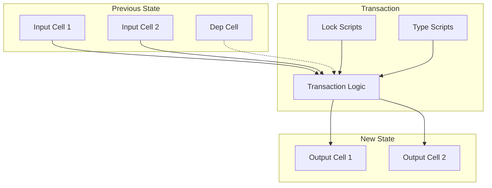
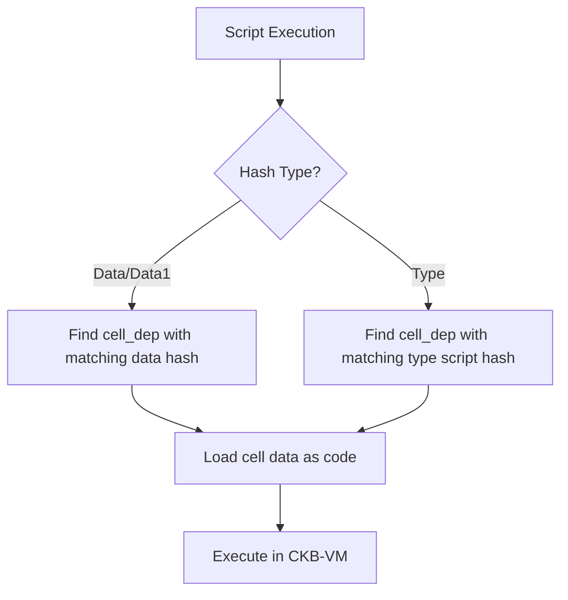
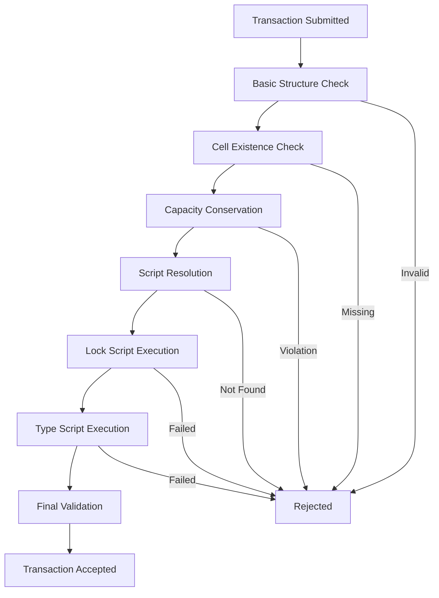

# CKB Transaction Structure

## Description

Comprehensive guide to CKB's transaction-oriented programming model, covering transaction anatomy, cell dependencies, lock/type scripts, witness structure, and validation processes. Contrasts with contract-oriented models, explains capacity conservation, script resolution, and provides practical development examples. Essential for understanding CKB's deterministic, parallel-processing architecture.

## Overview

CKB transactions are the fundamental unit of state transition on the Nervos network. Unlike account-based blockchains, CKB uses a transaction-oriented programming model with a UTXO-like cell model, enabling parallel processing, deterministic execution, and failure-free transactions.

## Transaction-Oriented vs Contract-Oriented Programming

### CKB's Transaction-Oriented Model

Nervos uses a transaction-oriented paradigm where developers describe the desired state change rather than calling contract methods. The transaction fully describes both the current state (inputs) and the desired resulting state (outputs) before execution.

**Key characteristics:**
- **Generation**: Transaction logic runs off-chain to compute desired state
- **Validation**: Scripts run on-chain to validate the proposed state change
- **Deterministic**: Transaction outcome is known before network submission
- **No Failed Transactions**: Invalid transactions are rejected without cost

### Traditional Contract-Oriented Model (e.g., Ethereum)

In contract-oriented systems, developers call contract methods that execute on-chain to modify state.

**Key characteristics:**
- **Execution**: Contract methods run on-chain to compute state changes
- **Non-deterministic**: Side effects and gas exhaustion can cause unexpected outcomes
- **Failed Transactions**: Failed executions still consume resources and fees

### Comparative Example: Counter Increment

**Contract-Oriented Approach:**
```solidity
// On-chain execution
contract Counter {
    uint256 public count = 5;
    
    function increment() public {
        count += 1; // Changes count from 5 to 6
    }
}

// Usage: Call increment() method
```

**Transaction-Oriented Approach (CKB):**
```rust
// Off-chain generation, on-chain validation
Transaction {
    inputs: [
        CellInput { 
            data: encode_u64(5), // Current counter state
            type_script: counter_script,
        }
    ],
    outputs: [
        CellOutput {
            data: encode_u64(6), // New counter state  
            type_script: counter_script,
        }
    ]
}

// Counter script validates: output_value == input_value + 1
```

### Advantages of Transaction-Oriented Model

1. **Scalability**: Generation (computationally intensive) happens off-chain
2. **Deterministic**: Exact outcome known before submission  
3. **No Erroneous Transactions**: Invalid transactions rejected without cost
4. **Parallel Processing**: Independent transactions can execute simultaneously
5. **Failure-Free**: No risk of partial execution or unexpected state changes

## Core Transaction Structure

```rust
// High-level transaction structure
struct Transaction {
    version: u32,           // Currently 0, reserved for future use
    cell_deps: Vec<CellDep>, // Dependency cells (read-only)
    header_deps: Vec<Byte32>, // Block header dependencies
    inputs: Vec<CellInput>,  // Input cells to consume
    outputs: Vec<CellOutput>, // Output cells to create
    outputs_data: Vec<Bytes>, // Data for each output cell
    witnesses: Vec<Bytes>,   // Witness data for validation
}
```

### Transaction Flow



## Cell Dependencies (cell_deps)

Dependencies provide read-only access to cells containing:
- Script code for lock and type scripts
- Reference data for validation
- Shared libraries and constants

```rust
struct CellDep {
    out_point: OutPoint,  // Points to the dependency cell
    dep_type: DepType,    // Code or DepGroup
}

enum DepType {
    Code,     // Single code cell
    DepGroup, // Bundle of multiple cells
}
```

### Dep Group Pattern

Dep Groups allow bundling multiple dependencies into a single reference:

```rust
// Dep Group cell data contains OutPoint list
let dep_group_data = vec![
    code_cell_outpoint,
    data_cell_outpoint,
    config_cell_outpoint,
];

// Transaction references the group
let cell_dep = CellDep {
    out_point: dep_group_outpoint,
    dep_type: DepType::DepGroup,
};

// CKB expands the group automatically
```

## Input Structure

```rust
struct CellInput {
    since: u64,           // Time-lock constraint
    previous_output: OutPoint, // Reference to cell being consumed
}

struct OutPoint {
    tx_hash: Byte32,     // Transaction hash that created the cell
    index: u32,          // Index in that transaction's outputs
}
```

### Input Processing

1. **Cell Reference**: Each input points to a previously created cell
2. **Liveness Check**: Referenced cells must be live (not already consumed)
3. **Lock Validation**: Lock scripts must authorize the spending
4. **Since Validation**: Time-lock constraints must be satisfied

## Output Structure

```rust
struct CellOutput {
    capacity: u64,       // Storage capacity in Shannons (1 CKB = 10^8 Shannons)
    lock: Script,        // Lock script (controls ownership)
    type_: Option<Script>, // Type script (validates state transitions)
}
```

### Capacity Rules

The capacity field serves dual purposes:
1. **Token Value**: Amount of CKB tokens stored
2. **Storage Limit**: Maximum bytes the cell can store

```rust
// Capacity constraint
occupied_bytes(cell) ≤ cell.capacity

// Conservation rule (excluding coinbase and DAO)
sum(input_capacities) ≥ sum(output_capacities)

// Miner fee
fee = sum(input_capacities) - sum(output_capacities)
```

## Scripts and Code Location

### Script Structure

```rust
struct Script {
    code_hash: Byte32,   // Hash identifying the code
    hash_type: HashType, // How to locate the code
    args: Bytes,         // Script arguments
}

enum HashType {
    Data,  // code_hash = hash(cell_data)
    Type,  // code_hash = hash(type_script) for upgradeability
    Data1, // Same as Data but with different VM version
}
```

### Code Resolution Process



## Lock Scripts

Lock scripts control **who** can spend a cell.

```rust
// Lock script execution context
pub fn lock_script_main() -> Result<(), Error> {
    // Read transaction data
    let tx_hash = load_tx_hash()?;
    let witnesses = load_witnesses()?;
    
    // Verify authorization (e.g., signature)
    verify_signature(&witnesses[0], &tx_hash)?;
    
    Ok(())
}
```

### Script Grouping

CKB groups inputs by script to avoid redundant execution:

```rust
// Group inputs with identical lock scripts
let groups = group_inputs_by_lock_script(transaction.inputs);

for (script, input_indices) in groups {
    // Execute script once for all inputs in group
    execute_script_for_group(script, input_indices)?;
}
```

## Type Scripts

Type scripts validate **what** happens to cells with specific types.

```rust
// Type script execution for state validation
pub fn type_script_main() -> Result<(), Error> {
    // Load inputs and outputs in current type group
    let input_cells = load_group_inputs()?;
    let output_cells = load_group_outputs()?;
    
    // Validate state transition rules
    validate_state_transition(&input_cells, &output_cells)?;
    
    Ok(())
}
```

### Type Script Use Cases

- **Token Logic**: UDT transfer and minting rules
- **State Machines**: Contract state transitions
- **NFTs**: Unique asset validation
- **DAOs**: Governance and treasury management

## Witness Structure

Witnesses provide additional data for script execution:

```rust
// Standard witness format
struct WitnessArgs {
    lock: Option<Bytes>,       // Lock script witness
    input_type: Option<Bytes>, // Input type script witness
    output_type: Option<Bytes>, // Output type script witness
}
```

### Witness Usage Patterns

```rust
// Signature in lock witness
let witness_args = WitnessArgs {
    lock: Some(signature_bytes),
    input_type: None,
    output_type: None,
};

// Complex type script data
let witness_args = WitnessArgs {
    lock: Some(signature_bytes),
    input_type: Some(state_transition_proof),
    output_type: Some(new_state_data),
};
```

## Header Dependencies

Header deps allow scripts to read block header information:

```rust
// Load header by dependency index
let header = load_header(header_index, Source::HeaderDep)?;
let timestamp = header.timestamp();
let block_number = header.number();

// Load header of input cell's creation block
let input_header = load_header(input_index, Source::Input)?;
```

### Use Cases

- **Time-based Logic**: Contracts needing timestamp access
- **DAO Withdrawals**: Calculate interest based on deposit block
- **Proof Systems**: Verify historical chain state

## Transaction Validation Process



## Hash Calculation

### Transaction Hash

```rust
// Transaction hash excludes witnesses
fn calculate_tx_hash(tx: &Transaction) -> Byte32 {
    let raw_tx = RawTransaction {
        version: tx.version,
        cell_deps: tx.cell_deps.clone(),
        header_deps: tx.header_deps.clone(),
        inputs: tx.inputs.clone(),
        outputs: tx.outputs.clone(),
        outputs_data: tx.outputs_data.clone(),
        // witnesses excluded
    };
    
    blake2b_hash(molecule_encode(raw_tx))
}
```

### Cell Data Hash

```rust
fn calculate_cell_data_hash(data: &[u8]) -> Byte32 {
    blake2b_hash(data)
}
```

### Script Hash

```rust
fn calculate_script_hash(script: &Script) -> Byte32 {
    blake2b_hash(molecule_encode(script))
}
```

## Advanced Patterns

### Atomic Operations

```rust
// Atomic swap between different token types
Transaction {
    inputs: vec![
        // Alice's Token A
        CellInput { /* Token A from Alice */ },
        // Bob's Token B  
        CellInput { /* Token B from Bob */ },
    ],
    outputs: vec![
        // Alice receives Token B
        CellOutput { 
            lock: alice_lock,
            type_: Some(token_b_script),
            // ...
        },
        // Bob receives Token A
        CellOutput {
            lock: bob_lock, 
            type_: Some(token_a_script),
            // ...
        },
    ],
    // Both parties must sign
    witnesses: vec![alice_signature, bob_signature],
}
```

### Parallel Processing

```rust
// CKB can process transactions in parallel when:
// 1. No overlapping input cells
// 2. Independent cell dependencies
// 3. Non-conflicting script execution

let tx1_inputs = [cell_a, cell_b];
let tx2_inputs = [cell_c, cell_d]; // No overlap with tx1

// tx1 and tx2 can execute in parallel
```

### Script Composition

```rust
// Combine multiple validation layers
struct ComposedCell {
    lock: multisig_lock,      // Requires 2-of-3 signatures
    type_: Some(udt_script),  // Token transfer rules
}

// Both lock and type scripts must pass
```

## Development Examples

### Basic Transfer Transaction

```rust
use ckb_types::{
    core::{TransactionBuilder, Capacity},
    packed::*,
    prelude::*,
};

fn create_transfer_transaction(
    from_cell: CellOutput,
    from_outpoint: OutPoint,
    to_lock: Script,
    amount: Capacity,
) -> Transaction {
    let remaining = from_cell.capacity().unpack() - amount.as_u64();
    
    TransactionBuilder::default()
        .input(CellInput::new(from_outpoint, 0))
        .output(CellOutput::new_builder()
            .capacity(amount.pack())
            .lock(to_lock)
            .build())
        .output(CellOutput::new_builder()
            .capacity(Capacity::shannons(remaining).pack())
            .lock(from_cell.lock())
            .build())
        .outputs_data(vec![Bytes::new(), Bytes::new()].pack())
        .build()
}
```

### Script Development

```rust
// Type script for custom token
use ckb_std::{
    ckb_constants::Source,
    high_level::{load_cell_data, load_script},
};

pub fn main() -> Result<(), Error> {
    // Load current script to get token configuration
    let script = load_script()?;
    let args = script.args().raw_data();
    
    // Parse token rules from args
    let owner_lock_hash = &args[0..32];
    let total_supply = u128::from_le_bytes(args[32..48].try_into()?);
    
    // Validate token operations
    validate_token_rules(owner_lock_hash, total_supply)?;
    
    Ok(())
}
```

## Best Practices

### Transaction Construction

1. **Capacity Planning**: Ensure sufficient capacity for cell storage
2. **Dependency Management**: Include all required cell_deps  
3. **Script Arguments**: Use consistent arg layouts across scripts
4. **Witness Optimization**: Minimize witness data size
5. **Parallel Compatibility**: Avoid unnecessary input overlaps

### Security Considerations

1. **Input Validation**: Verify all input cells exist and are live
2. **Script Verification**: Ensure proper script resolution
3. **Capacity Conservation**: Prevent token inflation attacks
4. **Witness Integrity**: Validate witness data authenticity
5. **Time-lock Compliance**: Respect since field constraints

### Performance Optimization

```rust
// Efficient cell loading
let mut total_capacity = 0u64;
let mut index = 0;

while let Ok(capacity) = load_cell_capacity(index, Source::Input) {
    total_capacity = total_capacity.saturating_add(capacity);
    index += 1;
}

// Batch operations when possible
let all_inputs = (0..input_count)
    .map(|i| load_cell(i, Source::Input))
    .collect::<Result<Vec<_>, _>>()?;
```

CKB's transaction structure provides a flexible foundation for building complex decentralized applications while maintaining security, determinism, and the ability for parallel processing. Understanding these fundamentals is essential for effective CKB development.